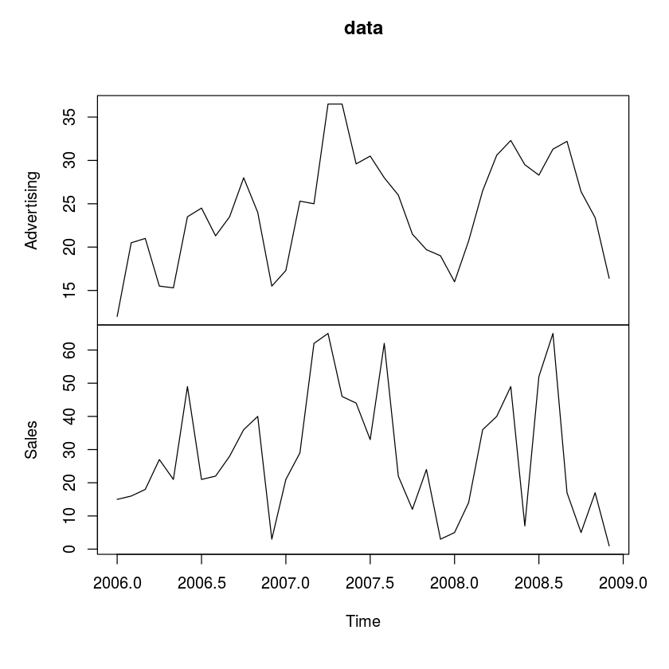
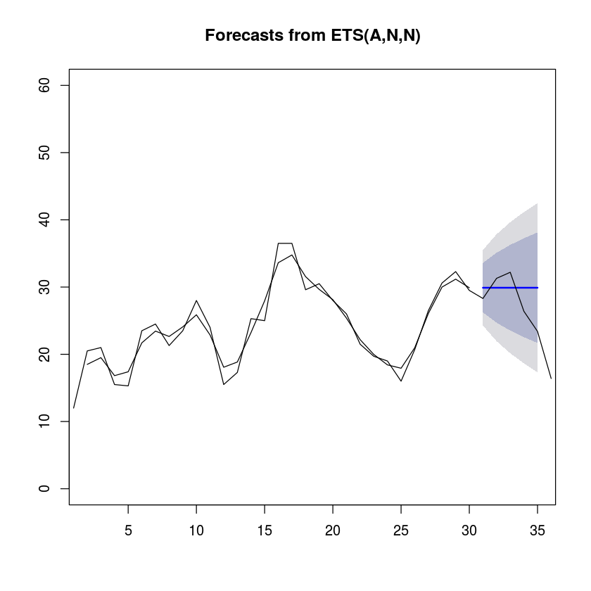
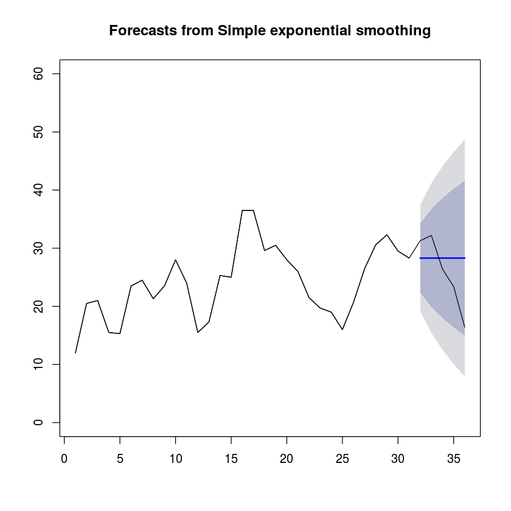
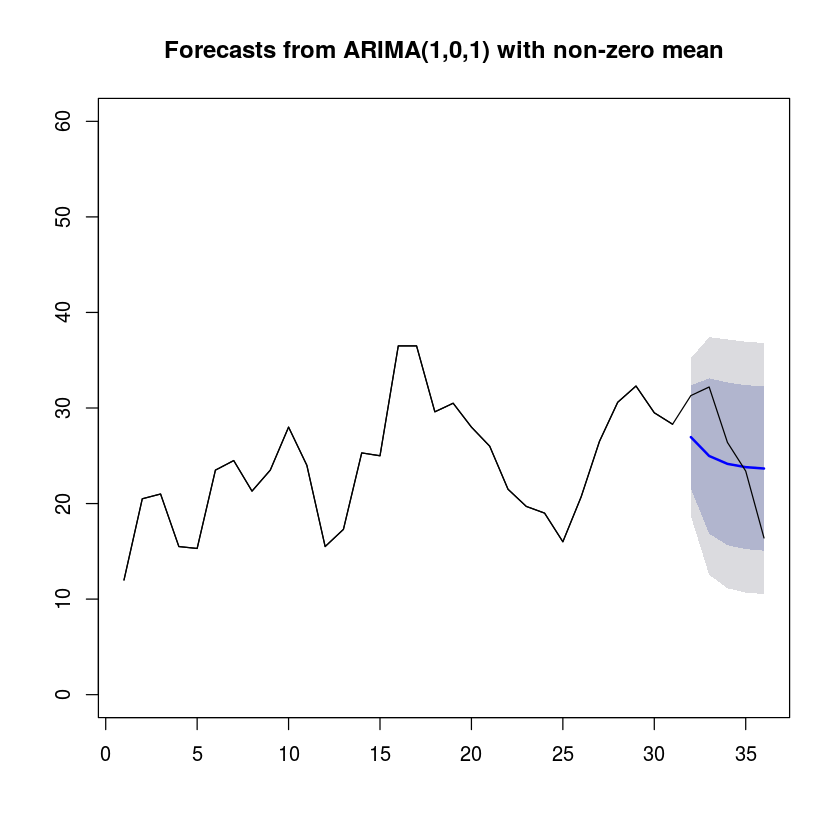

Forecasting refers to the process of using statistical procedures to predict future values of a time series based on historical trends. For businesses, being able gauge expected outcomes for a given time period is essential for managing marketing, planning, and finances. For example, an advertising agency may want to utilizes sales forecasts to identify which future months may require increased marketing expenditures. Companies may also use forecasts to identify which sales persons met their expected targets for a fiscal quarter.

There are a number of techniques that can be utilized to generate quantitative forecasts. Some methods are fairly simple while others are more robust and incorporate exogenous factors. Regardless of what is utilized, the first step should always be to visualize the data using a line graph. You want to consider how the metric changes over time, whether there is a distinct trend, or if there are distinct patterns that are noteworthy.


```R
data <- structure(c(12, 20.5, 21, 15.5, 15.3, 23.5, 24.5, 21.3, 23.5,
                    28, 24, 15.5, 17.3, 25.3, 25, 36.5, 36.5, 29.6, 30.5, 28, 26,
                    21.5, 19.7, 19, 16, 20.7, 26.5, 30.6, 32.3, 29.5, 28.3, 31.3,
                    32.2, 26.4, 23.4, 16.4, 15, 16, 18, 27, 21, 49, 21, 22, 28, 36,
                    40, 3, 21, 29, 62, 65, 46, 44, 33, 62, 22, 12, 24, 3, 5, 14,
                    36, 40, 49, 7, 52, 65, 17, 5, 17, 1),
                  .Dim = c(36L, 2L), .Dimnames = list(NULL, c("Advertising", "Sales")),
                  .Tsp = c(2006, 2008.91666666667, 12), class = c("mts", "ts", "matrix"))
head(data); nrow(data)
plot(data)
tdat <-data
```


<table>
<thead><tr><th>Advertising</th><th>Sales</th></tr></thead>
<tbody>
	<tr><td>12.0</td><td>15  </td></tr>
	<tr><td>20.5</td><td>16  </td></tr>
	<tr><td>21.0</td><td>18  </td></tr>
	<tr><td>15.5</td><td>27  </td></tr>
	<tr><td>15.3</td><td>21  </td></tr>
	<tr><td>23.5</td><td>49  </td></tr>
</tbody>
</table>


36





There are several key concepts that we should be cognizant of when describing time series data. These characteristics will inform how we pre-process the data and select the appropriate modeling technique and parameters. Ultimately, the goal is to simplify the patterns in the historical data by removing known sources of variatiion and making the patterns more consistent across the entire data set. Simpler patterns will generally lead to more accurate forecasts.

Trend: A trend exists when there is a long-term increase or decrease in the data.

Seasonality: A seasonal pattern occurs when a time series is affected by seasonal factors such as the time of the year or the day of the week.

Autocorrelation: Refers to the pheneomena whereby values of Y at time t are impacted by previous values of Y at t-i. To find the proper lag structure and the nature of auto correlated values in your data, use the autocorrelation function plot.

Stationary: A time series is said to be stationary if there is no systematic trend, no systematic change in variance, and if strictly periodic variations or seasonality do not exist

Quantitative forecasting techniques are usually based on reression analysis or time series techniques. Regression approaches examine the relationship between the forecasted variable and other explanatory variables using cross-sectional data. Time series models use hitorical data that’s been collected at regular intervals over time for the target variablle to forecast its future values. There isn’t time to cover the theory behind each of these approaches in this post, so I’ve chosen to cover high level concepts and provide code for performing time series forecasting in R. I strongly suggest understandig the statistical theory behind a technique before running the code.

First, we can use the ma function in the forecast package to perform forecasting using the moving average method. This technique estimates future values at time t by averaging values of the time series within k periods of t. When the time series is stationary, the moving average can be very effective as the observations are nearby across time.


```R
library(forecast)
moving_average = forecast(ma(tdat[1:31], order=2), h=5)
moving_average_accuracy = accuracy(moving_average, tdat[32:36])
moving_average; moving_average_accuracy
plot(moving_average, ylim=c(0,60))
lines(tdat[1:36])
```

    Warning message in ets(object, lambda = lambda, allow.multiplicative.trend = allow.multiplicative.trend, :
    "Missing values encountered. Using longest contiguous portion of time series"


       Point Forecast    Lo 80    Hi 80    Lo 95    Hi 95
    31       29.90013 26.22133 33.57893 24.27389 35.52637
    32       29.90013 24.69778 35.10248 21.94382 37.85643
    33       29.90013 23.52868 36.27157 20.15585 39.64441
    34       29.90013 22.54308 37.25717 18.64850 41.15176
    35       29.90013 21.67474 38.12551 17.32048 42.47977


<table>
<thead><tr><th></th><th>ME</th><th>RMSE</th><th>MAE</th><th>MPE</th><th>MAPE</th><th>MASE</th><th>ACF1</th></tr></thead>
<tbody>
	<tr><th>Training set</th><td> 0.3930552 </td><td>2.870582   </td><td>2.420911   </td><td>  0.9193872</td><td>10.08644   </td><td>0.9656057  </td><td>0.5547122  </td></tr>
	<tr><th>Test set</th><td>-3.9601275 </td><td>6.985772   </td><td>5.440026   </td><td>-22.3478669</td><td>26.99383   </td><td>2.1698107  </td><td>       NA  </td></tr>
</tbody>
</table>





The simple exponential smooting is also good when the data has no trend or seasonal patterns. Unlike a moving average, this technique gives greater weight to the most recent observations of the time series.


```R


exp <- ses(tdat[1:31], 5, initial="simple")
exp_accuracy = accuracy(exp, tdat[32:36])
exp; exp_accuracy
plot(exp, ylim=c(0,60))
lines(tdat[1:36])
```


       Point Forecast    Lo 80    Hi 80     Lo 95    Hi 95
    32           28.3 22.33966 34.26034 19.184451 37.41555
    33           28.3 19.87081 36.72919 15.408667 41.19133
    34           28.3 17.97639 38.62361 12.511406 44.08859
    35           28.3 16.37933 40.22067 10.068902 46.53110
    36           28.3 14.97228 41.62772  7.917013 48.68299


<table>
<thead><tr><th></th><th>ME</th><th>RMSE</th><th>MAE</th><th>MPE</th><th>MAPE</th><th>MASE</th><th>ACF1</th></tr></thead>
<tbody>
	<tr><th>Training set</th><td> 0.5258065 </td><td>4.650876   </td><td>3.564516   </td><td>  0.5582143</td><td>15.44111   </td><td>0.9677419  </td><td>0.1028762  </td></tr>
	<tr><th>Test set</th><td>-2.3600000 </td><td>6.219968   </td><td>5.120000   </td><td>-15.8003301</td><td>24.47892   </td><td>1.3900452  </td><td>       NA  </td></tr>
</tbody>
</table>





In the forecast package, there is an automatic forecasting function that will run through possible models and select the most appropriate model give the data. This could be an auto regressive model of the first oder (AR(1)), an ARIMA model with the right values for p, d, and q, or something else that is more appropriate.


```R
train = tdat[1:31]
test = tdat[32:36]
arma_fit <- auto.arima(train)
arma_forecast <- forecast(arma_fit, h = 5)
arma_fit_accuracy <- accuracy(arma_forecast, test)
arma_fit; arma_forecast; arma_fit_accuracy
plot(arma_forecast, ylim=c(0,60))
lines(tdat[1:36])
```


    Series: train 
    ARIMA(1,0,1) with non-zero mean 
    
    Coefficients:
             ar1     ma1  intercept
          0.4176  0.7081    23.5633
    s.e.  0.2032  0.1691     2.0441
    
    sigma^2 estimated as 17.75:  log likelihood=-87.69
    AIC=183.39   AICc=184.93   BIC=189.12


       Point Forecast    Lo 80    Hi 80    Lo 95    Hi 95
    32       26.95484 21.55606 32.35362 18.69812 35.21156
    33       24.97950 16.85044 33.10856 12.54717 37.41182
    34       24.15467 15.63871 32.67063 11.13063 37.17871
    35       23.81025 15.22861 32.39188 10.68577 36.93473
    36       23.66643 15.07339 32.25946 10.52451 36.80834


<table>
<thead><tr><th></th><th>ME</th><th>RMSE</th><th>MAE</th><th>MPE</th><th>MAPE</th><th>MASE</th><th>ACF1</th></tr></thead>
<tbody>
	<tr><th>Training set</th><td>0.2489983 </td><td>4.003663  </td><td>3.150455  </td><td>-2.1190014</td><td>14.43540  </td><td>0.855327  </td><td>-0.1393366</td></tr>
	<tr><th>Test set</th><td>1.2268642 </td><td>5.079899  </td><td>4.297534  </td><td>-0.2498815</td><td>18.17439  </td><td>1.166751  </td><td>        NA</td></tr>
</tbody>
</table>





There you go, a basic non-technical introduction to forecasting. This should get one familiar with the key concepts and how to perform some basic forecasting in R
